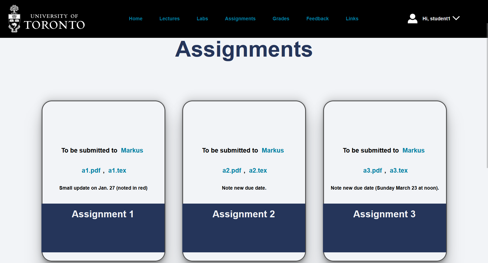

# Redesign Course Page — Python Flask

A lightweight redesign of a university course portal using **Flask (Python)**, **SQLite**, and **HTML/CSS/JavaScript**.  
The focus is a modernized, accessible UI and clear separation of **student** vs **instructor** flows, including instructor grade management.

> **Note**  
> This repository is a **portfolio showcase**. The code is **not licensed for reuse** (see License).

---

## Features

- **Role-based authentication**
  - Separate, secure login flows for **students** and **instructors**
  - Permission-scoped views and actions
- **Instructor tools**
  - Add / edit grades
  - View open remark requests (if applicable)
- **Student experience**
  - View personal information and grades
- **Modernized UI & accessibility**
  - Clear visual hierarchy and contrast
  - Keyboard-friendly navigation
  - Responsive layout
- **Simple, maintainable stack**
  - Flask + Jinja2 templating
  - SQLite database
  - Vanilla HTML/CSS/JavaScript for portability

---

## Tech Stack

- **Backend:** Python 3, Flask, Jinja2  
- **Database:** SQLite  
- **Frontend:** HTML, CSS, JavaScript

---

## Screenshots
<p align="center">
  <a href="screenshots/shot1.png"></a>
  <a href="screenshots/shot2.png"></a>
  <a href="screenshots/shot3.png"></a>
</p>
<p align="center">
  <a href="screenshots/shot4.png"></a>
  <a href="screenshots/shot5.png"></a>
  <a href="screenshots/shot6.png"></a>
</p>
<p align="center">
  <a href="screenshots/shot7.png"></a>
  <a href="screenshots/shot8.png"></a>
  <a href="screenshots/shot9.png"></a>
</p>

---

## Getting Started (Local)

### 1) Clone and enter the project
```bash
git clone <your-repo-url>.git
cd <repo-folder>
````

### 2) Create & activate a virtual environment

**Windows (PowerShell)**

```powershell
py -m venv .venv
.\.venv\Scripts\Activate
```

**macOS / Linux**

```bash
python3 -m venv .venv
source .venv/bin/activate
```

### 3) Install dependencies

```bash
pip install --upgrade pip
pip install Flask<3
```

### 4) Run the app

```bash
# Option A
python app.py

# Option B (Flask CLI)
# macOS / Linux
export FLASK_APP=app.py
export FLASK_ENV=development
flask run

# Windows PowerShell
$env:FLASK_APP="app.py"
$env:FLASK_ENV="development"
flask run
```

Open [http://127.0.0.1:5000/](http://127.0.0.1:5000/)

---

## Project Structure (typical)

```
.
├── app.py
├── templates/             # Jinja2 templates (HTML)
├── static/                # CSS, JS, images
├── coursepage.db         # SQLite database (sample/demo)
├── screenshots            # Screenshots for GitHub
└── README.md
```

---

## Accessibility Notes

* High-contrast color choices for body text and UI chrome
* Clear heading structure and form labels
* Reduced motion where appropriate

---

## Security & Data

* Demo database is for **local testing only**.
* Do **not** deploy with real student data.

---

## License

**All rights reserved.**
This repository is provided for **portfolio demonstration** only. You **may not** use, copy, modify, merge, publish, distribute, sublicense, or sell any part of this code without explicit written permission from the author.

If you’re interested in using or discussing the design/approach, please reach out.

---

## Contact

**Onur Özkan**
[onurozkanapp@gmail.com](mailto:onurozkanapp@gmail.com)

```
